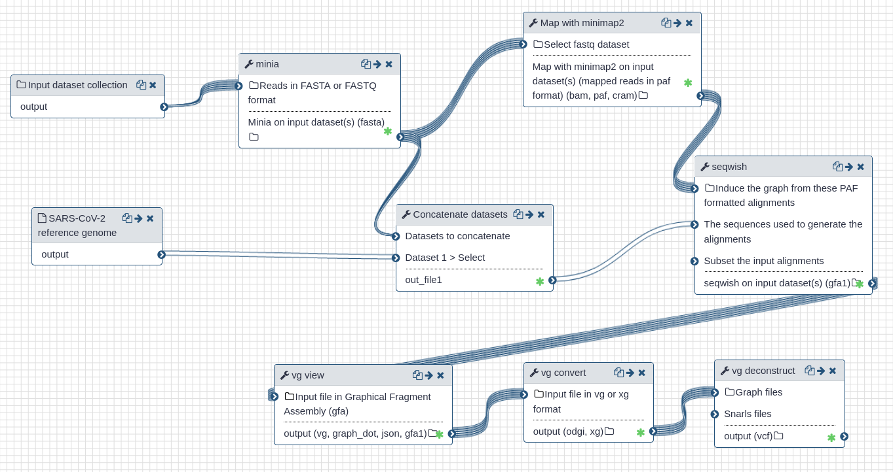

# Galaxy workbench

This page is summarizing the work done during the virtual Biohackathon to extend https://covid19.galaxyproject.org.

## used tools

| Name | Conda | Docker | rkt | Singularity | Galaxy |
|-------|:----:|:-----:|:-------:|:------:|:----:|
|sra-tools | [x](https://anaconda.org/bioconda/sra-tools) | [x](https://quay.io/repository/biocontainers/sra-tools) | [x](https://quay.io/repository/biocontainers/sra-tools) | [x](https://depot.galaxyproject.org/singularity/) | [x](https://toolshed.g2.bx.psu.edu/view/iuc/sra_tools/) |
|minia | [x](https://anaconda.org/bioconda/minia) | [x](https://quay.io/repository/biocontainers/minia) | [x](https://quay.io/repository/biocontainers/minia) | [x](https://depot.galaxyproject.org/singularity/) | [x](https://toolshed.g2.bx.psu.edu/view/iuc/minia/) |
|minimap2 | [x](https://anaconda.org/bioconda/minimap) | [x](https://quay.io/repository/biocontainers/minimap2) | [x](https://quay.io/repository/biocontainers/minimap2) |[x](https://depot.galaxyproject.org/singularity/) | [x](https://toolshed.g2.bx.psu.edu/view/iuc/minimap2/) |
|seqwish | [x](https://anaconda.org/bioconda/seqwish) | [x](https://quay.io/repository/biocontainers/seqwish) | [x](https://quay.io/repository/biocontainers/seqwish) |[x](https://depot.galaxyproject.org/singularity/) | [x](https://toolshed.g2.bx.psu.edu/view/iuc/seqwish/) |
|vg | [x](https://anaconda.org/bioconda/vg) | [x](https://quay.io/repository/biocontainers/vg) | [x](https://quay.io/repository/biocontainers/vg) |[x](https://depot.galaxyproject.org/singularity/) | [x](https://toolshed.g2.bx.psu.edu/view/iuc/vg_deconstruct/) |

A bunch of other tools interesting for the assembly work, like Quast, Trinity, Spades, Unicycler are also available.

## Workflow

* revisioned version of the workflow is available here at https://usegalaxy.eu/u/bgruening/w/sars-cov-2-vbiohackathon-workflow
* the data can be super noisy and erroneous, so the workflows filters datasets that yield to empty files or crashed tools
* workflow is parallelizable and was tested on 100+ inputs
* workflows (rather the tools inside a workflow) can run in Conda, Docker or Singularity
* one environment per step
* start the workflow from https://usegalaxy.eu or via CLI ([planemo](https://planemo.readthedocs.io))

## Data

* [Galaxy history](https://usegalaxy.eu/u/bgruening/h/45-sra-sars-cov-2-datasets-to-play-with) with 45 SRA accessions to play with.

## Data upload and updates - :fire: updated daily

* native ENA, UCSC ... integration
* data uploads tools, like sra-tools
* automatised, scriptable data uploads

* we are using the data from the https://covid19.galaxyproject.org
* these are **daily update** and new identifiers are added (SRA, GB ...) - public data only
* a bot is doing the work (example: https://github.com/galaxyproject/SARS-CoV-2/pull/108) (credits to @mvdbeek )
* these files (with accessing numbers) are than taken by Galaxy and feed into the workflow

## Miscellaneous

* SARS-CoV-2 was added as pre-configured reference genome
	* FASTA file
	* TwoBit index
	* Star index
	* Bowtie2 index
	* BWA-mem index

(Let us know if you need more pre-computed indices.)

* We extended the European Network for distributed computing by adding  CSC (Finland).
This means the European Galaxy server can now submit your jobs and workflows to Finland to be processed.

(Let us know if you have compute capacity and want to join the network.)

## Further readings
* [Assembly training](https://training.galaxyproject.org/training-material/topics/assembly/)
* [Variant analysis](https://training.galaxyproject.org/training-material/topics/variant-analysis/)
* [Pulsar Network](https://pulsar-network.readthedocs.io)

## Future work

* Consider writing a proper tutorial and adding it to https://covid19.galaxyproject.org
* run it daily as our other workflows
* fill https://virology.usegalaxy.eu with more content

## Credits
* [AMBARISH KKUMAR](https://github.com/ambarishK) https://orcid.org/0000-0002-4923-046X 
* [Marius van den Beek](https://github.com/mvdbeek)
* [Nicola Soranzo](https://github.com/nsoranzo)
* [Anton Nekrutenko](https://github.com/nekrut)
* [Wolfgang Maier](https://github.com/wm75)
* [Björn Grüning](https://github.com/bgruening)
* [Gianmauro Cuccuru](https://github.com/gmauro)
* [Frederik Coppens](https://github.com/frederikcoppens)

